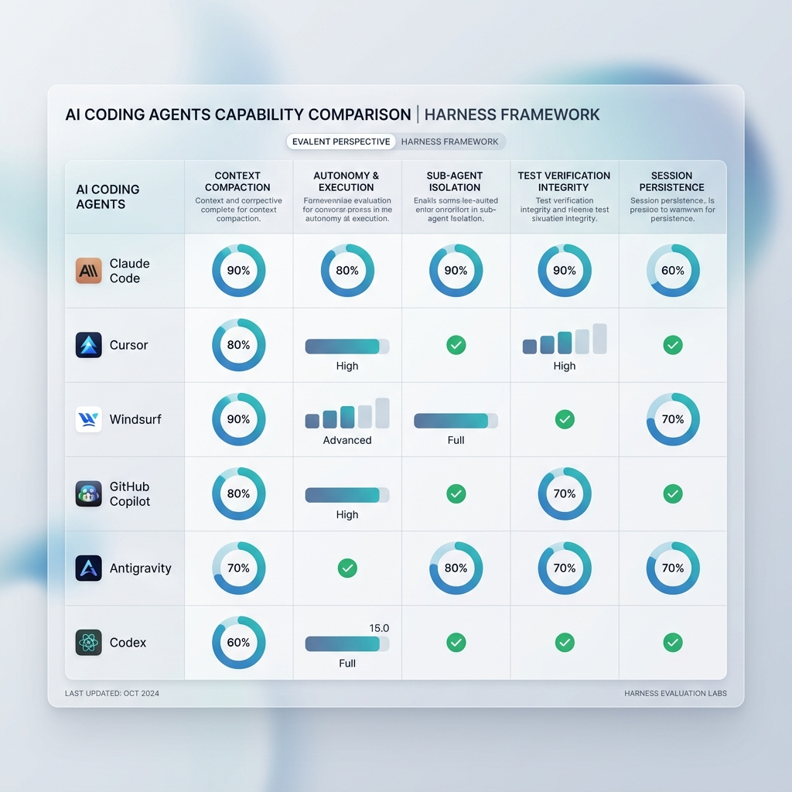

# Harness 🚀

> **Biến mọi repository mã nguồn thành một workspace sẵn sàng cho các AI Coding Agent.**

`harness` là một khung vận hành cấp repository (repository-level operating framework) dành cho **Claude Code, Codex, Cursor, Windsurf, GitHub Copilot, Antigravity** và các AI Coding Agent khác. 

Công cụ này cung cấp cho các AI Agent các ngữ cảnh còn thiếu của dự án trước khi chúng thay đổi mã nguồn: nên bắt đầu từ đâu, hợp đồng sản phẩm (product contract) yêu cầu gì, mức độ rủi ro ra sao, bằng chứng kiểm chứng (validation proof) cần những gì, và những quyết định kiến trúc nào cần kế thừa.

*Ứng dụng (App) là thứ người dùng chạm vào. Khung vận hành (Harness) là thứ AI Agent chạm vào.*

---

## 🌟 Tại sao bạn cần Harness?

Hầu hết các repository hiện nay được xây dựng cho con người đọc và hiểu. Khi các AI Coding Agent bước vào, chúng thường chỉ có lịch sử chat ngắn hạn và ảnh chụp nhanh (snapshot) nông cạn về các tệp tin. Điều này dẫn đến các lỗi phổ biến:

*   ❌ Agent sửa đổi mã nguồn trước khi hiểu rõ ý đồ sản phẩm.
*   ❌ Các ràng buộc nghiệp vụ quan trọng chỉ nằm trong lịch sử chat hoặc trong đầu lập trình viên.
*   ❌ Kỳ vọng kiểm chứng mơ hồ hoặc chỉ được phát hiện quá muộn.
*   ❌ Các quyết định kiến trúc bị lặp đi lặp lại thay vì được kế thừa.
*   ❌ Các yêu cầu lớn không được chia nhỏ thành các gói công việc (story) có thể review được.

### Giải pháp từ Harness

Harness giúp AI Agent trả lời các câu hỏi kỹ thuật thực tế mà không cần phụ thuộc vào lịch sử chat:

1.  **`AGENTS.md`** — Điểm bắt đầu (shim) ổn định cho Agent với các ghi chú cục bộ của dự án và liên kết tài liệu Harness.
2.  **`docs/HARNESS.md`** — Mô hình hợp tác giữa người và AI Agent.
3.  **`docs/FEATURE_INTAKE.md`** — Phân loại rủi ro công việc (tiny, normal, high-risk).
4.  **`docs/ARCHITECTURE.md`** — Các quy tắc ranh giới và khám phá kiến trúc.
5.  **`docs/TEST_MATRIX.md`** — Bảng đối chiếu giữa hành vi và bằng chứng kiểm chứng.
6.  **`docs/stories/`** — Các gói công việc kích thước story và backlog.
7.  **`docs/decisions/`** — Nhật ký lưu trữ các quyết định kiến trúc dài hạn (ADR).
8.  **`docs/templates/`** — Các bản mẫu đặc tả, story, quyết định và validation tiện dụng.

---

## 🔄 Quy trình hoạt động (Harness Loop)

Mọi yêu cầu công việc đi qua Harness sẽ tuân theo quy trình chuẩn hóa:

```text
Ý định của con người hoặc Spec dự án
  └──> Phân loại Feature Intake (Xác định rủi ro & làn đường)
        └──> Cập nhật tài liệu đặc tả sản phẩm (Product Contract)
              └──> Tạo gói công việc Story Packet (Nếu cần)
                    └──> Định nghĩa bằng chứng kiểm chứng (Validation Proof)
                          └──> AI Agent thực hiện viết code & kiểm thử
                                └──> Ghi nhận Quyết định kiến trúc & Khó khăn (Friction)
```

<picture>
  <source media="(prefers-color-scheme: dark)" srcset="docs/assets/ide-comparison-dashboard-dark.png">
  
</picture>

---

## 📥 Hướng dẫn cài đặt bằng Terminal

Bạn có thể cài đặt Harness theo hai cách: **Cài đặt toàn cục (Global)** để chạy lệnh `harness` ở bất kỳ đâu, hoặc **Cài đặt cục bộ (Local)** vào một dự án cụ thể.

---

### 🌎 Cách 1: Cài đặt toàn cục (Global CLI)

#### Option A: Cài đặt ngoại tuyến (Offline & Local Build) - Khuyên dùng & Cực kỳ an toàn
Nếu bạn vừa tải mã nguồn về hoặc kho lưu trữ GitHub chưa cấu hình phát hành (Release) công khai, bạn có thể biên dịch trực tiếp và cài đặt toàn cục chỉ với **2 lệnh**:

```bash
# 1. Biên dịch và sao chép tệp nhị phân vào thư mục bin của hệ thống
bash scripts/build-harness-cli-release.sh && mkdir -p ~/.local/bin && cp dist/harness-macos-arm64 ~/.local/bin/harness && chmod +x ~/.local/bin/harness

# 2. Cấu hình biến môi trường PATH để gọi lệnh 'harness' ở bất kỳ đâu
echo 'export PATH="$HOME/.local/bin:$PATH"' >> ~/.zshrc && source ~/.zshrc
```
*(Nếu bạn dùng Bash hoặc Fish shell thay vì Zsh, hãy đổi `~/.zshrc` tương ứng thành `~/.bashrc` hoặc `~/.config/fish/config.fish`)*.

#### Option B: Cài đặt trực tuyến (Online Curl)
Khi dự án đã có các phiên bản phát hành chính thức trên GitHub, bạn chỉ cần một câu lệnh để tự động tải và cấu hình:

```bash
curl -fsSL "https://raw.githubusercontent.com/baobao0303/harness/main/scripts/install-global.sh" | bash
```

> [!NOTE]
> *   Bộ cài đặt trực tuyến sẽ tự động nhận diện hệ điều hành (macOS/Linux) và kiến trúc CPU (arm64/x64).
> *   Tự động tải về binary phát hành tương ứng từ GitHub, xác thực mã băm SHA256 để đảm bảo an toàn.
> 
> Sau khi cài đặt bằng 1 trong 2 tùy chọn trên, bạn có thể kiểm tra trạng thái bằng cách gõ:
> ```bash
> harness query stats
> ```

---

### 📂 Cách 2: Cài đặt trực tiếp vào một dự án (Project Installation)

Nếu bạn muốn tích hợp toàn bộ cấu trúc thư mục Harness (`docs/`, `scripts/`, `AGENTS.md`) trực tiếp vào dự án hiện tại của mình, hãy chuyển đến thư mục dự án đó và chạy:

```bash
curl -fsSL "https://raw.githubusercontent.com/baobao0303/harness/main/scripts/install-harness.sh?$(date +%s)" | bash -s -- --yes
```

#### Các tùy chọn nâng cao khi cập nhật:

*   **Cập nhật bảo toàn (Merge)**: Đối với các dự án đã tích hợp sẵn Harness từ trước và bạn chỉ muốn tải thêm các file mới bổ sung mà không ghi đè lên các tài liệu hiện có:
    ```bash
    curl -fsSL "https://raw.githubusercontent.com/baobao0303/harness/main/scripts/install-harness.sh?$(date +%s)" | bash -s -- --merge --yes
    ```
*   **Ghi đè hoàn toàn (Override)**: Sao lưu toàn bộ thư mục Harness cũ và cài đặt mới hoàn toàn:
    ```bash
    curl -fsSL "https://raw.githubusercontent.com/baobao0303/harness/main/scripts/install-harness.sh?$(date +%s)" | bash -s -- --override --yes
    ```
*   **Làm sạch Agent Shim**: Chuyển đổi tệp `AGENTS.md` cồng kềnh cũ sang dạng shim gọn nhẹ ổn định:
    ```bash
    curl -fsSL "https://raw.githubusercontent.com/baobao0303/harness/main/scripts/install-harness.sh?$(date +%s)" | bash -s -- --merge --refresh-agent-shim --yes
    ```

---

## 🧠 Thư viện Kỹ năng (Skills Library)

Harness đi kèm **34 skill** có thể gọi từ bất kỳ IDE nào. Mỗi skill là một bộ hướng dẫn nghiệp vụ cụ thể giúp AI Agent thực hiện công việc theo quy trình chuẩn.

### Danh sách Skill theo giai đoạn

| Giai đoạn | Skill | Mô tả |
| :--- | :--- | :--- |
| **Khởi đầu** | `harness-help` | Phân tích trạng thái và gợi ý skill tiếp theo |
| | `harness-document-project` | Tạo tài liệu dự án cho AI context |
| | `harness-generate-project-context` | Tạo `project-context.md` |
| **Yêu cầu** | `harness-prd` | Tạo, sửa, hoặc validate PRD |
| | `harness-product-brief` | Tạo product brief |
| | `harness-advanced-elicitation` | Phê bình sâu (socratic, red team, pre-mortem) |
| | `harness-brainstorming` | Brainstorm ý tưởng |
| **Kiến trúc** | `harness-create-architecture` | Thiết kế kiến trúc hệ thống |
| | `harness-technical-research` | Nghiên cứu kỹ thuật |
| **Lập kế hoạch** | `harness-create-epics-and-stories` | Chia nhỏ requirements thành epics/stories |
| | `harness-create-story` | Tạo story file chi tiết |
| **Thiết kế** | `harness-create-ux-design` | Thiết kế UX/UI |
| **Triển khai** | `harness-check-implementation-readiness` | Kiểm tra sẵn sàng implement |
| | `harness-correct-course` | Điều chỉnh sprint khi có thay đổi |
| **Kiểm thử** | `harness-qa-generate-e2e-tests` | Tạo E2E tests tự động |
| **Review** | `harness-retrospective` | Retrospective sau epic |
| | `harness-checkpoint-preview` | Human-in-the-loop review |
| **Tài liệu** | `harness-index-docs` | Tạo index cho thư mục docs |
| | `harness-shard-doc` | Chia nhỏ tài liệu lớn |
| | `harness-distillator` | Nén tài liệu cho LLM |
| **Đặc biệt** | `harness-party-mode` | Multi-agent roundtable discussion |
| | `harness-investigate` | Điều tra bug forensic |
| | `harness-customize` | Tùy chỉnh skill behavior |

### Cách gọi Skill từ mỗi IDE

Mỗi IDE có cơ chế discover skill riêng, nhưng tất cả đều trỏ về cùng một source `.agents/skills/<name>/SKILL.md`:

| IDE | Cách gọi | Format |
| :--- | :--- | :--- |
| **Kiro** | Gõ `#` trong chat → chọn skill | `.kiro/steering/*.md` |
| **Cursor** | Gõ `@` hoặc xem Rules panel | `.cursor/rules/*.mdc` |
| **Windsurf** | Agent đọc tự động | `.windsurfrules` |
| **Claude Code** | Nói tên skill trong prompt | `AGENTS.md` skill table |
| **GitHub Copilot** | Nói tên skill trong prompt | `AGENTS.md` skill table |
| **CLI** | `harness skill list` / `harness skill run <name>` | Terminal |

### Generate Skill Files cho IDE

Sau khi cài đặt Harness, chạy lệnh sau để tạo skill discovery files cho tất cả IDE:

```bash
scripts/install-ide-skills.sh
```

Hoặc chỉ cho một IDE cụ thể:

```bash
scripts/install-ide-skills.sh --tool kiro
scripts/install-ide-skills.sh --tool cursor
scripts/install-ide-skills.sh --tool windsurf
scripts/install-ide-skills.sh --tool claude-code
```

> [!TIP]
> Khi bạn chạy `harness init`, script sẽ tự động generate skill files cho tất cả IDE được phát hiện trong dự án.

---

## 🛠️ Các câu lệnh cơ bản (Global Commands)

Khi đã cài đặt global, bạn có thể thực hiện quản lý dự án nhanh chóng bằng các lệnh sau:

| Lệnh | Chức năng |
| :--- | :--- |
| `harness init` | Khởi tạo cơ sở dữ liệu hoạt động (`harness.db`) và generate skill files cho IDE. |
| `harness skill list` | Hiển thị danh sách tất cả skill có sẵn. |
| `harness skill run <name>` | Chạy một skill cụ thể (nếu có wrapper). |
| `harness intake --type <type> --summary "<nội dung>" --lane <lane>` | Đăng ký phân loại rủi ro cho một yêu cầu tính năng mới. |
| `harness story add --id <id> --title "<tiêu đề>" --lane <lane>` | Tạo mới một gói công việc story trong Test Matrix. |
| `harness story update --id <id> --status <status> --evidence "<bằng chứng>"` | Cập nhật tiến độ kiểm chứng (`planned`, `in_progress`, `implemented`). |
| `harness trace --summary "<mô tả>" --outcome <outcome> --agent <tên>` | Ghi nhận nhật ký dấu vết hoạt động của AI Agent. |
| `harness query stats` | Hiển thị tóm tắt thống kê số lượng dữ liệu trong workspace. |
| `harness query matrix` | Hiển thị bảng ma trận kiểm chứng chất lượng và tiến độ. |
| `harness query decisions` | Hiển thị danh sách các quyết định kiến trúc đã được thông qua. |

---

## 🏗️ Cấu trúc thư mục tích hợp trong dự án

Khi cài đặt vào dự án, cấu trúc thư mục của bạn sẽ trông như thế này:

```text
your-project/
  ├── AGENTS.md             # Tệp shim hướng dẫn cho AI Agent
  ├── README.md             # Tài liệu dự án của bạn
  ├── harness.db            # Database SQLite lưu trữ lịch sử hoạt động (đã được gitignore)
  ├── docs/
  │    ├── HARNESS.md       # Tài liệu hướng dẫn mô hình hợp tác
  │    ├── FEATURE_INTAKE.md# Quy tắc phân loại rủi ro công việc
  │    ├── ARCHITECTURE.md  # Tài liệu quy tắc kiến trúc hệ thống
  │    ├── product/         # Chứa tài liệu đặc tả sản phẩm thực tế
  │    ├── stories/         # Chứa các tệp mô tả gói công việc chi tiết
  │    ├── decisions/       # Nhật ký Quyết định Kiến trúc (ADR)
  │    └── templates/       # Các bản mẫu cấu trúc tiện dụng
  └── scripts/
       └── harness          # Trình khởi chạy CLI dự án dự phòng
```

---

## 🤝 Đóng góp

Dự án này đang trong giai đoạn phát triển và sẽ được tối ưu hóa liên tục dựa trên các case study thực tế từ quá trình vận hành của AI Agent. Nếu bạn gặp bất kỳ lỗi hoạt động hoặc có đề xuất cải tiến nào, hãy tạo Issue hoặc gửi Pull Request!

Hãy ⭐ star repository này nếu bạn thấy ý tưởng giúp AI Coding Agent hoạt động an toàn và hiệu quả hơn là hữu ích!
