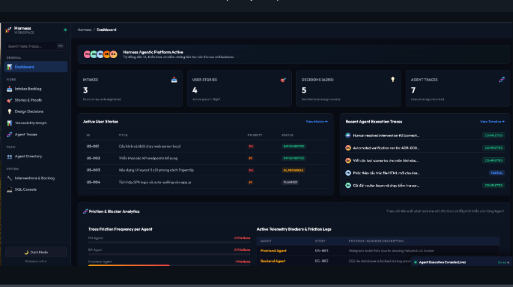

# Harness 🚀

> **Biến mọi repository mã nguồn thành một workspace sẵn sàng cho các AI Coding Agent.**

`harness` là một khung vận hành cấp repository (repository-level operating framework) dành cho **Claude Code, Codex, Cursor, Windsurf, GitHub Copilot, Antigravity** và các AI Coding Agent khác. 

Công cụ này cung cấp cho các AI Agent các ngữ cảnh còn thiếu của dự án trước khi chúng thay đổi mã nguồn: nên bắt đầu từ đâu, hợp đồng sản phẩm (product contract) yêu cầu gì, mức độ rủi ro ra sao, bằng chứng kiểm chứng (validation proof) cần những gì, và những quyết định kiến trúc nào cần kế thừa.

*Ứng dụng (App) là thứ người dùng chạm vào. Khung vận hành (Harness) là thứ AI Agent chạm vào.*

---

## 🌟 Tại sao bạn cần Harness?

Hầu hết các repository hiện nay được xây dựng cho con người đọc và hiểu. Khi các AI Coding Agent bước vào, chúng thường chỉ có lịch sử chat ngắn hạn và ảnh chụp nhanh (snapshot) nông cạn về các tệp tin. Điều này dẫn đến các lỗi phổ biến:

*   ❌ Agent sửa đổi mã nguồn trước khi hiểu rõ ý đồ sản phẩm.
*   ❌ Các ràng buộc nghiệp vụ quan trọng chỉ nằm trong lịch sử chat hoặc trong đầu lập trình viên.
*   ❌ Kỳ vọng kiểm chứng mơ hồ hoặc chỉ được phát hiện quá muộn.
*   ❌ Các quyết định kiến trúc bị lặp đi lặp lại thay vì được kế thừa.
*   ❌ Các yêu cầu lớn không được chia nhỏ thành các gói công việc (story) có thể review được.

### Giải pháp từ Harness

Harness giúp AI Agent trả lời các câu hỏi kỹ thuật thực tế mà không cần phụ thuộc vào lịch sử chat:

1.  **`AGENTS.md`** — Điểm bắt đầu (shim) ổn định cho Agent với các ghi chú cục bộ của dự án và liên kết tài liệu Harness.
2.  **`docs/HARNESS.md`** — Mô hình hợp tác giữa người và AI Agent.
3.  **`docs/FEATURE_INTAKE.md`** — Phân loại rủi ro công việc (tiny, normal, high-risk).
4.  **`docs/ARCHITECTURE.md`** — Các quy tắc ranh giới và khám phá kiến trúc.
5.  **`docs/TEST_MATRIX.md`** — Bảng đối chiếu giữa hành vi và bằng chứng kiểm chứng.
6.  **`docs/stories/`** — Các gói công việc kích thước story và backlog.
7.  **`docs/decisions/`** — Nhật ký lưu trữ các quyết định kiến trúc dài hạn (ADR).
8.  **`docs/templates/`** — Các bản mẫu đặc tả, story, quyết định và validation tiện dụng.

---

## 🔄 Quy trình hoạt động (Harness Loop)

Mọi yêu cầu công việc đi qua Harness sẽ tuân theo quy trình chuẩn hóa:

```text
Ý định của con người hoặc Spec dự án
  └──> Phân loại Feature Intake (Xác định rủi ro & làn đường)
        └──> Cập nhật tài liệu đặc tả sản phẩm (Product Contract)
              └──> Tạo gói công việc Story Packet (Nếu cần)
                    └──> Định nghĩa bằng chứng kiểm chứng (Validation Proof)
                          └──> AI Agent thực hiện viết code & kiểm thử
                                └──> Ghi nhận Quyết định kiến trúc & Khó khăn (Friction)
```


---

## 🖥️ Web UI Performance Dashboard

Harness đi kèm một giao diện Dashboard quản lý hiệu năng hoạt động của dự án thời gian thực, lấy cảm hứng từ giao diện **Paperclip** với các hiệu ứng kính mờ (glassmorphism).

### Các tính năng nổi bật của Web UI:
1. **Interactive SQLite Console 💻**: Giao diện thực thi câu lệnh SQL trực tiếp, được tích hợp cổng bảo mật (chỉ cho phép các lệnh truy vấn an toàn như `SELECT` hoặc `PRAGMA`).
2. **Omnibar Command Palette 🔍**: Nhấn `Cmd+K` (hoặc ô tìm kiếm ở sidebar) để mở thanh điều lệnh đa năng hỗ trợ các lệnh tắt (như `/goto [tab]`, `/verify [adr]`, `/approve [intervention]`, `/create [entity]`).
3. **Real-time Agent Workloads 👥**: Theo dõi trạng thái hoạt động của các AI Agent trong tổ chức thời gian thực thông qua luồng WebSocket sự kiện telemetry.
4. **Drag-and-Drop Kanban Priority Sandbox 🗂️**: Bảng Kanban kéo thả cho các đề xuất cải tiến Backlog, tự động cập nhật mức độ ưu tiên trực tiếp xuống SQLite qua API.
5. **Friction & Blocker Analytics 📈**: Biểu đồ phân tích tần suất ma sát phát triển (frictions) của từng Agent và log lỗi phát sinh để kịp thời hỗ trợ.

### Cách khởi chạy Web UI:
Biên dịch và khởi chạy server Axum:
```bash
cargo run --package harness-web
```
Dashboard sẽ hiển thị tại: **`http://localhost:3000`**

---


## 📥 Hướng dẫn cài đặt và Khởi chạy Chi tiết (Installation & Setup)

Harness có thể được cài đặt toàn cục dưới dạng CLI để phục vụ việc điều phối Agent, hoặc khởi chạy nhanh chóng trực tiếp từ mã nguồn để phát triển và trải nghiệm Dashboard.

### 📋 1. Yêu cầu hệ thống (System Requirements)
Trước khi bắt đầu, hãy đảm bảo hệ thống của bạn đã được cài đặt:
*   **Rust & Cargo** (phiên bản mới nhất) để biên dịch dự án Rust.
*   **SQLite3** để quản lý cơ sở dữ liệu cục bộ (`harness.db`).

---

### 🚀 2. Khởi chạy nhanh từ Mã nguồn (Quickstart from Source)

Để chạy thử nghiệm toàn bộ hệ thống Harness (bao gồm CLI và Web UI Dashboard) ngay từ mã nguồn vừa tải về, hãy thực hiện theo các bước sau:

#### Bước 2.1: Biên dịch và cài đặt CLI cục bộ
Biên dịch dự án Harness CLI từ mã nguồn và tạo liên kết (hoặc chép) file nhị phân vào thư mục bin cá nhân để có thể gọi lệnh `harness` từ bất kỳ đâu:
```bash
# Biên dịch CLI với phiên bản release tối ưu hóa
cargo build --release --package harness-cli

# Tạo thư mục bin cá nhân nếu chưa có và sao chép binary vào đó
mkdir -p ~/.local/bin
cp target/release/harness-cli ~/.local/bin/harness
chmod +x ~/.local/bin/harness

# Cấu hình biến môi trường PATH để hệ thống nhận diện lệnh 'harness'
echo 'export PATH="$HOME/.local/bin:$PATH"' >> ~/.zshrc && source ~/.zshrc
```
*(Nếu sử dụng Bash hoặc các shell khác, hãy cập nhật tệp cấu hình tương ứng như `~/.bashrc`)*.

#### Bước 2.2: Khởi tạo cơ sở dữ liệu (`harness.db`)
Chạy lệnh khởi tạo để tự động tạo file database SQLite và áp dụng các tệp schema di trú (migrations) trong thư mục `scripts/schema/`:
```bash
harness init
```
Lệnh này sẽ tạo ra file cơ sở dữ liệu `harness.db` tại gốc thư mục dự án và thiết lập cấu trúc bảng cho intakes, stories, decisions, traces,...

#### Bước 2.3: Nạp dữ liệu mẫu (Seed Demo Data)
Để Web UI Dashboard hiển thị đầy đủ các biểu đồ, dữ liệu mẫu, Kanban và lịch sử hoạt động như hình minh họa ở trên, hãy nạp file dữ liệu mẫu:
```bash
sqlite3 harness.db < scripts/seed_demo_data.sql
```

#### Bước 2.4: Chạy kiểm thử hệ thống (Optional)
Đảm bảo tất cả các chức năng hoạt động chính xác bằng cách chạy bộ kiểm thử đơn vị:
```bash
cargo test
```

#### Bước 2.5: Khởi chạy Web UI Performance Dashboard
Biên dịch và chạy Axum web server:
```bash
cargo run --package harness-web
```
Sau khi server chạy, hãy truy cập vào trình duyệt: **`http://localhost:3000`** để bắt đầu tương tác với các tính năng:
*   **Kanban board**: Kéo thả để cập nhật độ ưu tiên.
*   **SQL Console**: Truy vấn SQLite trực tiếp.
*   **Omnibar**: Nhấn `Cmd+K` để thực thi nhanh các lệnh tắt.

---

### 🌎 3. Cài đặt Toàn cục qua CLI Script (Global Installation)

Nếu bạn muốn cài đặt Harness toàn cục trên máy tính một cách nhanh chóng qua các kịch bản cài đặt tự động (phục vụ cho việc điều hướng Agent trong các thư mục dự án khác):

#### Tùy chọn A: Biên dịch Release cục bộ & Cài đặt tự động
```bash
# Biên dịch gói nhị phân tương ứng với OS/CPU và cài đặt toàn cục
bash scripts/build-harness-cli-release.sh && mkdir -p ~/.local/bin && cp dist/harness-macos-arm64 ~/.local/bin/harness && chmod +x ~/.local/bin/harness

# Cập nhật PATH
echo 'export PATH="$HOME/.local/bin:$PATH"' >> ~/.zshrc && source ~/.zshrc
```

#### Tùy chọn B: Tải trực tiếp phiên bản phát hành từ GitHub (Online Curl)
```bash
curl -fsSL "https://raw.githubusercontent.com/baobao0303/harness/main/scripts/install-global.sh" | bash
```

> [!NOTE]
> Bộ cài đặt trực tuyến sẽ tự động phát hiện Hệ điều hành (macOS/Linux) cùng kiến trúc CPU (arm64/x64) để tải về và kiểm tra tính toàn vẹn (SHA256) của file nhị phân.
>
> Kiểm tra cài đặt thành công:
> ```bash
> harness query stats
> ```

---

### 📂 4. Tích hợp trực tiếp vào dự án của bạn (Project Integration)

Để tích hợp toàn bộ khung làm việc của Harness (`docs/`, `scripts/`, `AGENTS.md`) vào một dự án phần mềm có sẵn của bạn, hãy di chuyển tới thư mục gốc của dự án đó và thực thi:

```bash
curl -fsSL "https://raw.githubusercontent.com/baobao0303/harness/main/scripts/install-harness.sh?$(date +%s)" | bash -s -- --yes
```

#### Các tùy chọn nâng cao khi cập nhật Harness trong dự án:
*   **Cập nhật bảo toàn (Merge - Khuyên dùng)**: Chỉ bổ sung các file Harness còn thiếu, không làm ảnh hưởng tới các tài liệu đặc tả hiện có của bạn:
    ```bash
    curl -fsSL "https://raw.githubusercontent.com/baobao0303/harness/main/scripts/install-harness.sh?$(date +%s)" | bash -s -- --merge --yes
    ```
*   **Ghi đè hoàn toàn (Override)**: Sao lưu toàn bộ thư mục Harness cũ sang bản backup và cài đặt mới hoàn toàn:
    ```bash
    curl -fsSL "https://raw.githubusercontent.com/baobao0303/harness/main/scripts/install-harness.sh?$(date +%s)" | bash -s -- --override --yes
    ```
*   **Làm sạch Agent Shim**: Cập nhật file `AGENTS.md` thành một shim gọn nhẹ hướng dẫn Agent truy cập các liên kết tài liệu:
    ```bash
    curl -fsSL "https://raw.githubusercontent.com/baobao0303/harness/main/scripts/install-harness.sh?$(date +%s)" | bash -s -- --merge --refresh-agent-shim --yes
    ```

---

## 🧠 Thư viện Kỹ năng (Skills Library)

Harness đi kèm **34 skill** có thể gọi từ bất kỳ IDE nào. Mỗi skill là một bộ hướng dẫn nghiệp vụ cụ thể giúp AI Agent thực hiện công việc theo quy trình chuẩn.

### Danh sách Skill theo giai đoạn

| Giai đoạn | Skill | Mô tả |
| :--- | :--- | :--- |
| **Khởi đầu** | `harness-help` | Phân tích trạng thái và gợi ý skill tiếp theo |
| | `harness-document-project` | Tạo tài liệu dự án cho AI context |
| | `harness-generate-project-context` | Tạo `project-context.md` |
| **Yêu cầu** | `harness-prd` | Tạo, sửa, hoặc validate PRD |
| | `harness-product-brief` | Tạo product brief |
| | `harness-advanced-elicitation` | Phê bình sâu (socratic, red team, pre-mortem) |
| | `harness-brainstorming` | Brainstorm ý tưởng |
| **Kiến trúc** | `harness-create-architecture` | Thiết kế kiến trúc hệ thống |
| | `harness-technical-research` | Nghiên cứu kỹ thuật |
| **Lập kế hoạch** | `harness-create-epics-and-stories` | Chia nhỏ requirements thành epics/stories |
| | `harness-create-story` | Tạo story file chi tiết |
| **Thiết kế** | `harness-create-ux-design` | Thiết kế UX/UI |
| **Triển khai** | `harness-check-implementation-readiness` | Kiểm tra sẵn sàng implement |
| | `harness-correct-course` | Điều chỉnh sprint khi có thay đổi |
| **Kiểm thử** | `harness-qa-generate-e2e-tests` | Tạo E2E tests tự động |
| **Review** | `harness-retrospective` | Retrospective sau epic |
| | `harness-checkpoint-preview` | Human-in-the-loop review |
| **Tài liệu** | `harness-index-docs` | Tạo index cho thư mục docs |
| | `harness-shard-doc` | Chia nhỏ tài liệu lớn |
| | `harness-distillator` | Nén tài liệu cho LLM |
| **Đặc biệt** | `harness-party-mode` | Multi-agent roundtable discussion |
| | `harness-investigate` | Điều tra bug forensic |
| | `harness-customize` | Tùy chỉnh skill behavior |

### Cách gọi Skill từ mỗi IDE

Mỗi IDE có cơ chế discover skill riêng, nhưng tất cả đều trỏ về cùng một source `.agents/skills/<name>/SKILL.md`:

| IDE | Cách gọi | Format |
| :--- | :--- | :--- |
| **Kiro** | Gõ `#` trong chat → chọn skill | `.kiro/steering/*.md` |
| **Cursor** | Gõ `@` hoặc xem Rules panel | `.cursor/rules/*.mdc` |
| **Windsurf** | Agent đọc tự động | `.windsurfrules` |
| **Claude Code** | Nói tên skill trong prompt | `AGENTS.md` skill table |
| **GitHub Copilot** | Nói tên skill trong prompt | `AGENTS.md` skill table |
| **CLI** | `harness skill list` / `harness skill run <name>` | Terminal |

### Generate Skill Files cho IDE

Sau khi cài đặt Harness, chạy lệnh sau để tạo skill discovery files cho tất cả IDE:

```bash
scripts/install-ide-skills.sh
```

Hoặc chỉ cho một IDE cụ thể:

```bash
scripts/install-ide-skills.sh --tool kiro
scripts/install-ide-skills.sh --tool cursor
scripts/install-ide-skills.sh --tool windsurf
scripts/install-ide-skills.sh --tool claude-code
```

> [!TIP]
> Khi bạn chạy `harness init`, script sẽ tự động generate skill files cho tất cả IDE được phát hiện trong dự án.

---

## 🛠️ Các câu lệnh cơ bản (Global Commands)

Khi đã cài đặt global, bạn có thể thực hiện quản lý dự án nhanh chóng bằng các lệnh sau:

| Lệnh | Chức năng |
| :--- | :--- |
| `harness init` | Khởi tạo cơ sở dữ liệu hoạt động (`harness.db`) và generate skill files cho IDE. |
| `harness skill list` | Hiển thị danh sách tất cả skill có sẵn. |
| `harness skill run <name>` | Chạy một skill cụ thể (nếu có wrapper). |
| `harness intake --type <type> --summary "<nội dung>" --lane <lane>` | Đăng ký phân loại rủi ro cho một yêu cầu tính năng mới. |
| `harness story add --id <id> --title "<tiêu đề>" --lane <lane>` | Tạo mới một gói công việc story trong Test Matrix. |
| `harness story update --id <id> --status <status> --evidence "<bằng chứng>"` | Cập nhật tiến độ kiểm chứng (`planned`, `in_progress`, `implemented`). |
| `harness trace --summary "<mô tả>" --outcome <outcome> --agent <tên>` | Ghi nhận nhật ký dấu vết hoạt động của AI Agent. |
| `harness query stats` | Hiển thị tóm tắt thống kê số lượng dữ liệu trong workspace. |
| `harness query matrix` | Hiển thị bảng ma trận kiểm chứng chất lượng và tiến độ. |
| `harness query decisions` | Hiển thị danh sách các quyết định kiến trúc đã được thông qua. |

---

## 🏗️ Cấu trúc thư mục tích hợp trong dự án

Khi cài đặt vào dự án, cấu trúc thư mục của bạn sẽ trông như thế này:

```text
your-project/
  ├── AGENTS.md             # Tệp shim hướng dẫn cho AI Agent
  ├── README.md             # Tài liệu dự án của bạn
  ├── harness.db            # Database SQLite lưu trữ lịch sử hoạt động (đã được gitignore)
  ├── docs/
  │    ├── HARNESS.md       # Tài liệu hướng dẫn mô hình hợp tác
  │    ├── FEATURE_INTAKE.md# Quy tắc phân loại rủi ro công việc
  │    ├── ARCHITECTURE.md  # Tài liệu quy tắc kiến trúc hệ thống
  │    ├── product/         # Chứa tài liệu đặc tả sản phẩm thực tế
  │    ├── stories/         # Chứa các tệp mô tả gói công việc chi tiết
  │    ├── decisions/       # Nhật ký Quyết định Kiến trúc (ADR)
  │    └── templates/       # Các bản mẫu cấu trúc tiện dụng
  └── scripts/
       └── harness          # Trình khởi chạy CLI dự án dự phòng
```

---

## 🤝 Đóng góp

Dự án này đang trong giai đoạn phát triển và sẽ được tối ưu hóa liên tục dựa trên các case study thực tế từ quá trình vận hành của AI Agent. Nếu bạn gặp bất kỳ lỗi hoạt động hoặc có đề xuất cải tiến nào, hãy tạo Issue hoặc gửi Pull Request!

Hãy ⭐ star repository này nếu bạn thấy ý tưởng giúp AI Coding Agent hoạt động an toàn và hiệu quả hơn là hữu ích!
