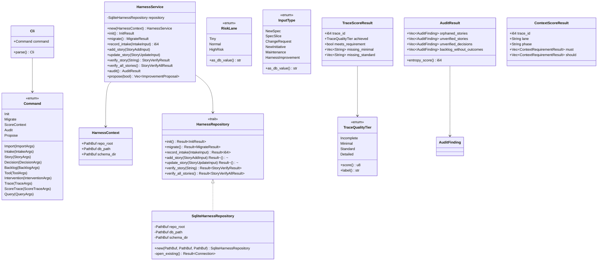

# Harness CLI Architecture & UML Diagrams

This document details the actual software architecture and design of the Rust-based `harness-cli` application.

---

## 1. Layered Architecture

The application is structured into four main layers following Clean Architecture and DDD principles:

```mermaid
graph TD
    subgraph Interface Layer (interface.rs & main.rs)
        Main[main.rs] --> Cli[Cli Struct / Clap Parser]
        Cli --> Run[run function]
    end

    subgraph Application Layer (application.rs)
        Run --> Service[HarnessService]
        Service --> Context[HarnessContext]
        Service --> Inputs[Input Structs: IntakeInput, StoryAddInput...]
    end

    subgraph Domain Layer (domain.rs)
        Service -.-> DomainLogic[Logic: score_trace, score_context...]
        Service -.-> DomainModels[Models: StoryMatrixRecord, DecisionRecord, AuditResult...]
    end

    subgraph Infrastructure Layer (infrastructure.rs)
        Service --> RepoTrait[<< trait >> HarnessRepository]
        RepoImpl[SqliteHarnessRepository] -- implements --> RepoTrait
        RepoImpl --> SQLite[(SQLite DB: harness.db)]
    end

    style Interface Layer fill:#f9f,stroke:#333,stroke-width:2px
    style Application Layer fill:#bbf,stroke:#333,stroke-width:2px
    style Domain Layer fill:#bfb,stroke:#333,stroke-width:2px
    style Infrastructure Layer fill:#fbb,stroke:#333,stroke-width:2px
```

---

## 2. Class Diagram

The following diagram illustrates the relationship between CLI arguments, the application service, the infrastructure repositories, and domain models.



---

## 3. Layers & Core Responsibilities

### Interface Layer (`interface.rs` & `main.rs`)
- **CLI Arg Parsing:** Uses `clap` to define commands, options, and flags.
- **Input Transformation:** Sanitizes and parses command line arguments into domain/application models.
- **Output Presenter:** Standardizes standard output and formatting (tabular layout, list format) when presenting results to the user.

### Application Layer (`application.rs`)
- **Use Case Orchestration:** Coordinates business tasks and operations.
- **HarnessService:** Tightly couples the use case actions to the persistence layer via `HarnessRepository`.
- **DTOs / Inputs:** Holds inputs like `IntakeInput`, `StoryAddInput`, `TraceInput` to move cleanly structured data between boundary layers.

### Domain Layer (`domain.rs`)
- **Pure Entities & Value Objects:** Represents the fundamental concepts like `StoryMatrixRecord`, `TraceRecord`, `DecisionRecord`, `BacklogRecord`.
- **Trace Quality Scoring (`score_trace`):** Evaluates if a given trace fits quality criteria (Minimal, Standard, Detailed) corresponding to the risk lane requirements.
- **Context Read Auditing (`score_context`):** Analyzes what files a coding agent accessed to score it against `CONTEXT_RULES.md`.
- **Entropy Score Calculation (`AuditResult::entropy_score`):** Determines the health score of the repo by inspecting orphaned, stale, or unverified items.

### Infrastructure Layer (`infrastructure.rs`)
- **Trait Definition:** `HarnessRepository` abstracts database access.
- **SQLite Persistence:** `SqliteHarnessRepository` implements the repository interface, executing database writes, runs migrations, and handles SQL execution against `harness.db` using `rusqlite`.
