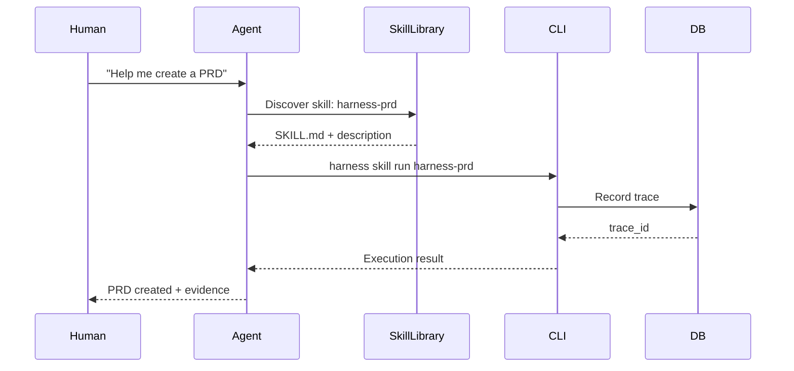
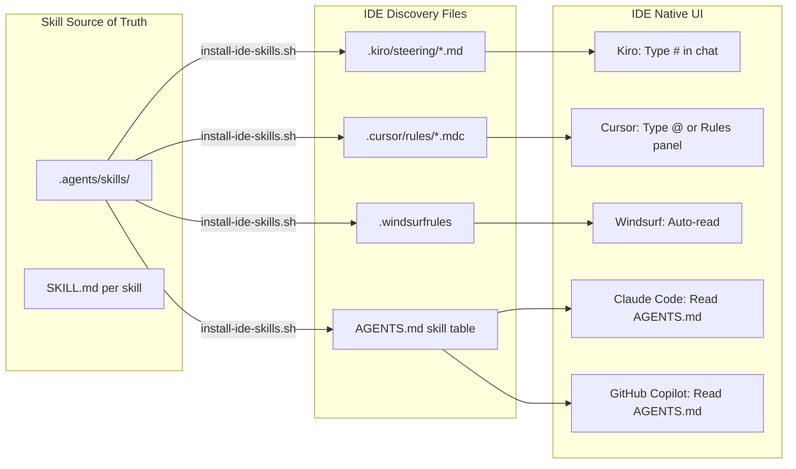
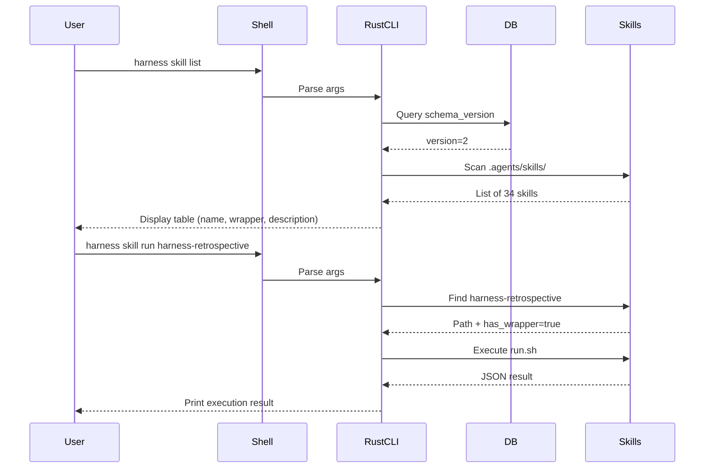
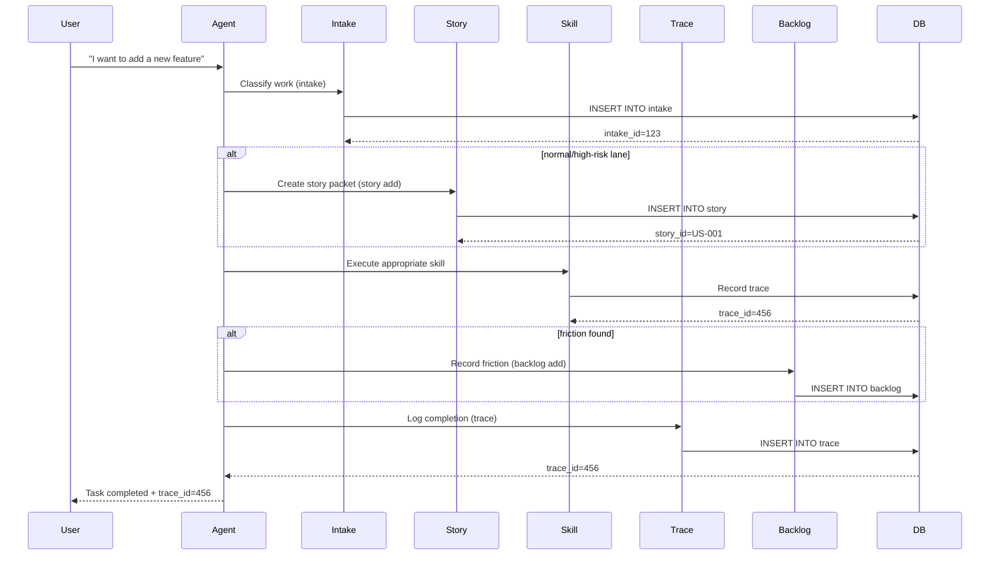
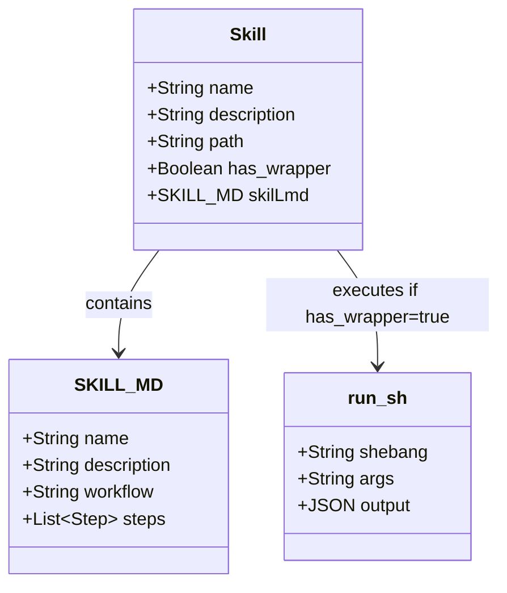
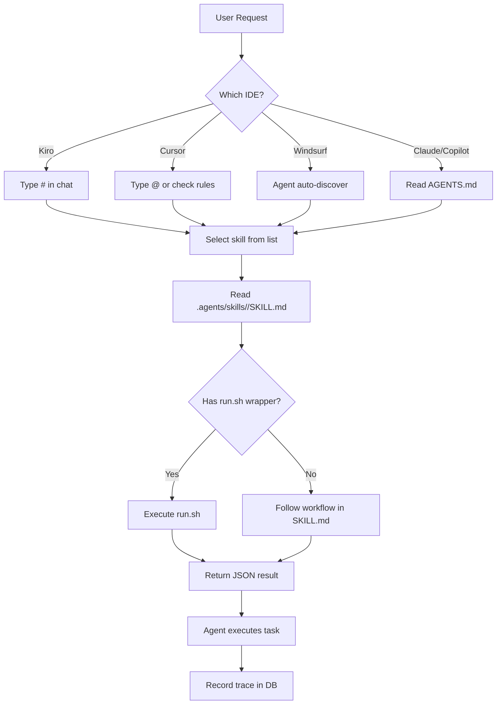

# 🧠 Thư viện Kỹ năng (Skills Library) - UML Diagrams

## Overview

Harness cung cấp **34 skill** được tổ chức theo lifecycle phát triển phần mềm. Mỗi skill là một bộ hướng dẫn nghiệp vụ cụ thể giúp AI Agent thực hiện công việc theo quy trình chuẩn.

## Skill Lifecycle UML

## Skill Categories UML

```mermaid
graph TD
    Root[Harness Skills Library] --> Init[Khởi Đầu]
    Root --> Requirements[Yêu Cầu]
    Root --> Architecture[Kiến Trúc]
    Root --> Planning[Lập Kế Hoạch]
    Root --> Design[Thiết Kế]
    Root --> Implementation[Triển Khai]
    Root --> Testing[Kiểm Thử]
    Root --> Review[Review]
    Root --> Docs[Tài Liệu]
    Root --> Special[Đặc Biệt]

    Init --> Help[harness-help]
    Init --> DocProject[harness-document-project]
    Init --> ProjContext[harness-generate-project-context]

    Requirements --> PRD[harness-prd]
    Requirements --> Brief[harness-product-brief]
    Requirements --> Elicitation[harness-advanced-elicitation]
    Requirements --> Brainstorm[harness-brainstorming]

    Architecture --> CreateArch[harness-create-architecture]
    Architecture --> TechResearch[harness-technical-research]

    Planning --> CreateEpics[harness-create-epics-and-stories]
    Planning --> CreateStory[harness-create-story]

    Design --> CreateUX[harness-create-ux-design]

    Implementation --> CheckReady[harness-check-implementation-readiness]
    Implementation --> CorrectCourse[harness-correct-course]

    Testing --> GenerateE2E[harness-qa-generate-e2e-tests]

    Review --> Retrospective[harness-retrospective]
    Review --> Checkpoint[harness-checkpoint-preview]

    Docs --> IndexDocs[harness-index-docs]
    Docs --> ShardDoc[harness-shard-doc]
    Docs --> Distillator[harness-distillator]

    Special --> PartyMode[harness-party-mode]
    Special --> Investigate[harness-investigate]
    Special --> Customize[harness-customize]
```

## IDE Integration UML

## CLI Command Flow UML

## Task Loop Integration UML

## Skill Metadata Structure

## IDE-Specific Discovery

| IDE | Discovery Mechanism | File Format | Trigger |
| :--- | :--- | :--- | :--- |
| **Kiro** | Steering files | `.kiro/steering/*.md` | Type `#` in chat |
| **Cursor** | Rule files | `.cursor/rules/*.mdc` | Type `@` or Rules panel |
| **Windsurf** | Consolidated file | `.windsurfrules` | Agent auto-read |
| **Claude Code** | AGENTS.md | Markdown table | Agent reads AGENTS.md |
| **GitHub Copilot** | AGENTS.md | Markdown table | Agent reads AGENTS.md |

## Skill Invocation Flow

