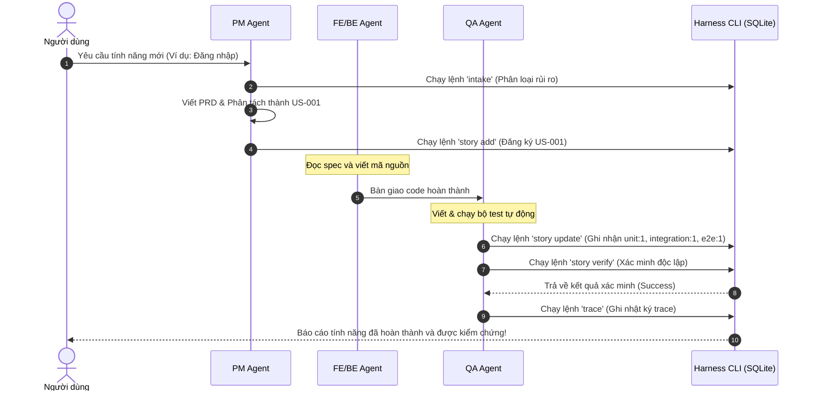

# Quy trình chạy Nhiệm vụ (Harness Task Execution Flow)

Tài liệu này mô tả chi tiết luồng chạy của một nhiệm vụ (Task) trong hệ thống Harness thông qua sơ đồ trực quan Mermaid và hướng dẫn từng bước thực hiện.

---

## 📊 1. Sơ đồ Luồng Công việc (Flowchart)

Sơ đồ dưới đây thể hiện các bước thực hiện tuần tự và vai trò của từng Agent tham gia trong luồng chạy task:

```mermaid
graph TD
    Start([Ý định / Yêu cầu từ Con người]) --> Phase1[Bước 1: Phân loại rủi ro - Intake]
    
    subgraph Giai đoạn Khởi tạo (PM / BA)
        Phase1 -->|Lệnh: harness intake| RiskCheck{Phân loại làn đường?}
        RiskCheck -->|Tiny| LowRisk[Làn đường Tiny: Dev chạy thẳng code]
        RiskCheck -->|Normal / High-risk| HighRisk[Làn đường Normal/High-risk: Yêu cầu đặc tả]
    end

    subgraph Giai đoạn Đặc tả & Lập kế hoạch (PM / BA / Architect)
        HighRisk --> CreatePRD["Viết PRD & Thiết kế Kiến trúc (ADR)"]
        CreatePRD --> SliceStories["Phân rã thành các Story và xác định cách kiểm chứng"]
        SliceStories -->|Lệnh: harness story add| RegisterStories[Đăng ký Stories vào database]
    end

    subgraph Giai đoạn Phát triển & Viết Test (FE / BE / QA)
        LowRisk --> DevCode["Viết code tính năng"]
        RegisterStories --> DevCode
        DevCode --> WriteTests["Viết mã kiểm thử tự động (Unit / Integration / E2E)"]
    end

    subgraph Giai đoạn Kiểm chứng & Nghiệm thu (QA / Auditor)
        WriteTests --> UpdateStory["Cập nhật bằng chứng kiểm thử vào Story"]
        UpdateStory -->|Lệnh: harness story update| DB[(SQLite Database)]
        UpdateStory --> RunVerify["Chạy lệnh xác minh tự động"]
        RunVerify -->|Lệnh: harness story verify| VerifyCheck{Mọi bài test đều PASS?}
        VerifyCheck -->|No| FixCode[Sửa code / Fix bugs]
        FixCode --> WriteTests
        VerifyCheck -->|Yes| RecordTrace["Ghi nhận vết thực thi của Agent"]
        RecordTrace -->|Lệnh: harness trace| LogTrace[Lưu nhật ký Trace vào DB]
    end

    subgraph Giai đoạn Hoàn tất
        LogTrace --> AuditCheck["Chạy Audit kiểm tra độ trôi (Drift) & Cải tiến"]
        AuditCheck -->|Lệnh: harness audit & propose| Finished([Hoàn thành & Bàn giao])
    end

    %% Tô màu giao diện trực quan
    style RiskCheck fill:#f9f,stroke:#333,stroke-width:2px
    style VerifyCheck fill:#f9f,stroke:#333,stroke-width:2px
    style DB fill:#cce5ff,stroke:#004085,stroke-width:2px
    style Finished fill:#d4edda,stroke:#28a745,stroke-width:3px
```

---

## 🔄 2. Sơ đồ Tuần tự Tương tác (Sequence Diagram)

Sơ đồ dưới đây biểu diễn cách các vai trò Agent tương tác với nhau và với `harness-cli` trong một vòng đời chạy task:



---

## 📋 3. Hướng dẫn các câu lệnh thực thi tương ứng

### Bước 1: Khởi tạo Intake (PM)
```bash
./scripts/bin/harness-cli intake --type "Feature" --summary "Mô tả tính năng" --lane normal
```

### Bước 2: Đăng ký câu chuyện công việc - Story (PM)
```bash
./scripts/bin/harness-cli story add --id US-001 --title "Tiêu đề câu chuyện" --lane normal
```

### Bước 3: Cập nhật bằng chứng kiểm thử (QA)
```bash
./scripts/bin/harness-cli story update --id US-001 --status implemented --evidence "Đã pass bộ kiểm thử" --unit 1 --integration 1 --e2e 0
```

### Bước 4: Chạy lệnh kiểm chứng tự động (QA)
```bash
./scripts/bin/harness-cli story verify US-001
```

### Bước 5: Ghi nhận nhật ký vết thực thi (QA/Developer)
```bash
./scripts/bin/harness-cli trace --summary "Hoàn thành code & test" --story US-001 --agent Antigravity --outcome completed
```
