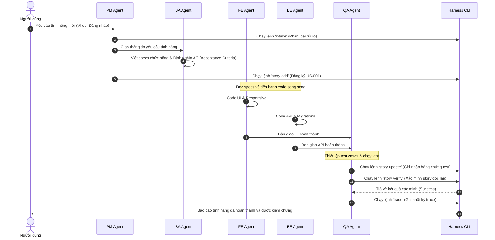

# Quy trình chạy Nhiệm vụ (Harness Task Execution Flow)

Tài liệu này mô tả chi tiết luồng chạy của một nhiệm vụ (Task) trong hệ thống Harness thông qua sơ đồ trực quan Mermaid và hướng dẫn từng bước thực hiện cho từng vai trò Agent chuyên biệt.

---

## 📊 1. Sơ đồ Luồng Công việc (Flowchart)

Sơ đồ dưới đây thể hiện các bước thực hiện tuần tự và vai trò của từng Agent tham gia trong luồng chạy task:

```mermaid
graph TD
    Start([Ý định / Yêu cầu từ Con người]) --> Phase1[Bước 1: Phân loại rủi ro - PM Agent]
    
    subgraph Giai đoạn Khởi tạo (PM & BA)
        Phase1 -->|Lệnh: harness intake| RiskCheck{Phân loại làn đường?}
        RiskCheck -->|Tiny| LowRisk[Làn đường Tiny: Dev chạy thẳng code]
        RiskCheck -->|Normal / High-risk| HighRisk[Làn đường Normal/High-risk: Yêu cầu đặc tả]
    end

    subgraph Giai đoạn Đặc tả & Lập kế hoạch (PM, BA & Architect)
        HighRisk --> CreatePRD["PM & BA Agent:<br>Viết PRD & Đặc tả chức năng"]
        CreatePRD --> SliceStories["PM & BA Agent:<br>Phân rã thành các Story & AC"]
        SliceStories -->|Lệnh: harness story add| RegisterStories[Đăng ký Stories vào database]
    end

    subgraph Giai đoạn Phát triển (FE & BE)
        LowRisk --> DevFE["FE Agent:<br>Xây dựng giao diện (UI)"]
        LowRisk --> DevBE["BE Agent:<br>Xây dựng API & Database"]
        RegisterStories --> DevFE
        RegisterStories --> DevBE
    end

    subgraph Giai đoạn Kiểm thử & Báo cáo (QA)
        DevFE --> WriteTests["QA Agent:<br>Viết mã kiểm thử tự động (Unit / Integration / E2E)"]
        DevBE --> WriteTests
        WriteTests --> UpdateStory["QA Agent:<br>Cập nhật bằng chứng kiểm thử vào Story"]
        UpdateStory -->|Lệnh: harness story update| DB[(SQLite Database)]
        UpdateStory --> RunVerify["QA Agent:<br>Chạy lệnh xác minh tự động"]
        RunVerify -->|Lệnh: harness story verify| VerifyCheck{Mọi bài test đều PASS?}
        VerifyCheck -->|No| FixCode[Sửa code / Fix bugs]
        FixCode --> WriteTests
        VerifyCheck -->|Yes| RecordTrace["QA/Dev Agent:<br>Ghi nhận vết thực thi"]
        RecordTrace -->|Lệnh: harness trace| LogTrace[Lưu nhật ký Trace vào DB]
    end

    subgraph Giai đoạn Hoàn tất (Auditor)
        LogTrace --> AuditCheck["Auditor Agent:<br>Chạy Audit kiểm tra độ trôi (Drift)"]
        AuditCheck -->|Lệnh: harness audit & propose| Finished([Hoàn thành & Bàn giao])
    end

    %% Tô màu giao diện trực quan
    style RiskCheck fill:#f9f,stroke:#333,stroke-width:2px
    style VerifyCheck fill:#f9f,stroke:#333,stroke-width:2px
    style DB fill:#cce5ff,stroke:#004085,stroke-width:2px
    style Finished fill:#d4edda,stroke:#28a745,stroke-width:3px
```

---

## 🔄 2. Sơ đồ Tuần tự Tương tác (Sequence Diagram)

Sơ đồ dưới đây biểu diễn cách cả 5 vai trò Agent tương tác với nhau và với `harness-cli` trong một vòng đời chạy task:



---

## 📋 3. Hướng dẫn các câu lệnh thực thi tương ứng

### Bước 1: Khởi tạo Intake (PM)
```bash
./scripts/bin/harness-cli intake --type "Feature" --summary "Mô tả tính năng" --lane normal
```

### Bước 2: Đăng ký câu chuyện công việc - Story (PM)
```bash
./scripts/bin/harness-cli story add --id US-001 --title "Tiêu đề câu chuyện" --lane normal
```

### Bước 3: Cập nhật bằng chứng kiểm thử (QA)
```bash
./scripts/bin/harness-cli story update --id US-001 --status implemented --evidence "Đã pass bộ kiểm thử" --unit 1 --integration 1 --e2e 0
```

### Bước 4: Chạy lệnh kiểm chứng tự động (QA)
```bash
./scripts/bin/harness-cli story verify US-001
```

### Bước 5: Ghi nhận nhật ký vết thực thi (QA/Developer)
```bash
./scripts/bin/harness-cli trace --summary "Hoàn thành code & test" --story US-001 --agent Antigravity --outcome completed
```

---

## 🧠 4. Hướng dẫn nạp vai trò Agent (Calling Agent Personas)

Để gọi đúng Agent thực hiện tác vụ cho từng giai đoạn, bạn chỉ cần ra lệnh cho AI trong phần chat (prompt) trỏ tới file chỉ dẫn nhập vai tương ứng:

*   **Giai đoạn Khởi tạo & Lập kế hoạch**:
    > *"Hãy đóng vai trò là **PM Agent** (đọc cấu hình tại `.agents/personas/pm.md`) và **BA Agent** (đọc `.agents/personas/ba.md`) để phân tích yêu cầu tính năng [Mô tả yêu cầu], phân làn rủi ro và chia nhỏ câu chuyện."*
*   **Giai đoạn Phát triển Frontend**:
    > *"Hãy đóng vai trò là **FE Agent** (đọc cấu hình tại `.agents/personas/fe.md`) để hiện thực hóa giao diện UI cho câu chuyện US-001."*
*   **Giai đoạn Phát triển Backend**:
    > *"Hãy đóng vai trò là **BE Agent** (đọc cấu hình tại `.agents/personas/be.md`) để xây dựng database schema, API endpoint cho câu chuyện US-002."*
*   **Giai đoạn Kiểm thử & Đăng ký bằng chứng**:
    > *"Hãy đóng vai trò là **QA Agent** (đọc cấu hình tại `.agents/personas/qa.md`) để viết kịch bản test tự động, chạy lệnh xác minh và ghi nhận bằng chứng lên ma trận kiểm thử của Harness."*
