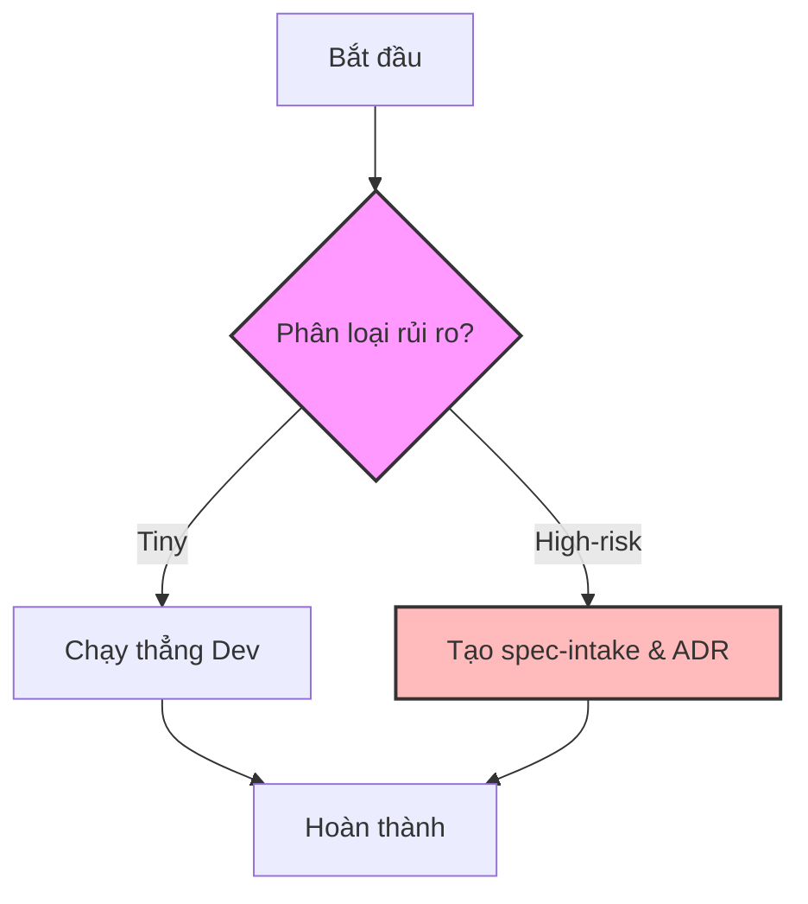
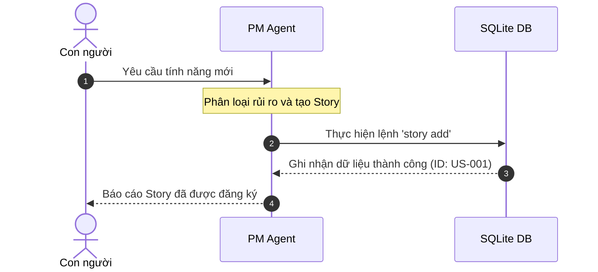
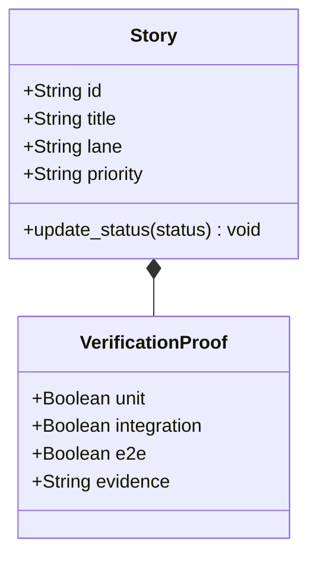
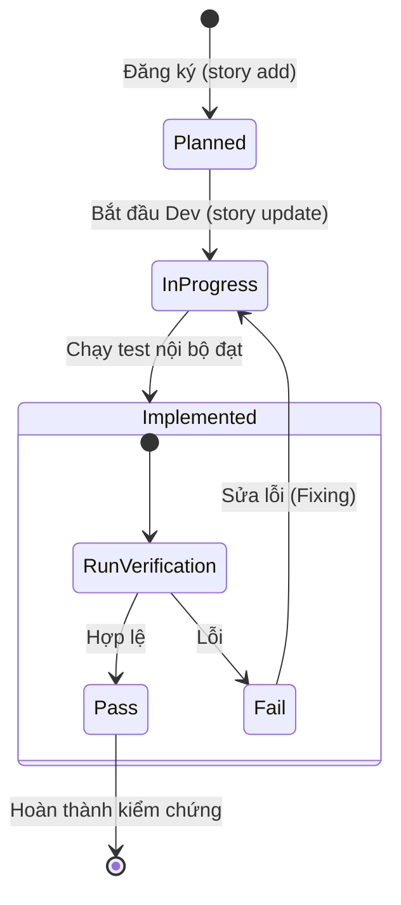
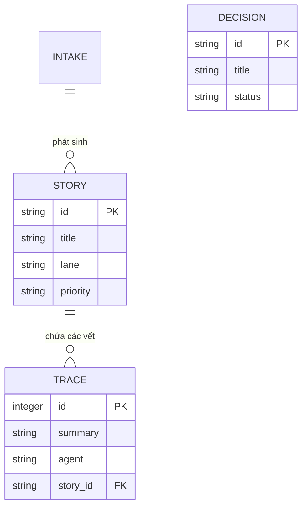

# Hướng dẫn vẽ Sơ đồ UML bằng Mermaid trong Harness

Mermaid là một công cụ mạnh mẽ giúp chuyển đổi mã văn bản thành sơ đồ trực quan (Flowchart, Sequence, Class, State, ER Diagrams). 

Tất cả tài liệu của Harness sử dụng Mermaid vì nó **dễ đọc, lưu trữ dưới dạng text trong Git** và tự động render trực quan trên GitHub hoặc các IDE như Cursor/Windsurf.

---

## 📌 Các quy tắc chung để tránh lỗi cú pháp
1.  **Sử dụng dấu ngoặc kép**: Nếu nhãn của nút (node label) chứa các ký tự đặc biệt như dấu đóng mở ngoặc `( )`, `[ ]`, hoặc khoảng trắng, hãy bọc nhãn đó trong dấu ngoặc kép.
    *   *Sai*: `A[Hàm main()]`
    *   *Đúng*: `A["Hàm main()"]`
2.  **Tránh thẻ HTML**: Không sử dụng các thẻ HTML (`<br>`, `<b>`) trực tiếp trong nhãn trừ khi thực sự cần thiết, để tránh lỗi parser.
3.  **Hướng vẽ sơ đồ (Flowchart Direction)**:
    *   `TD` hoặc `TB`: Vẽ từ trên xuống dưới (Top-Down / Top-Bottom).
    *   `LR`: Vẽ từ trái sang phải (Left-to-Right).
    *   `RL`: Vẽ từ phải sang trái.

---

## 📊 1. Sơ đồ Luồng Công việc (Flowchart)
Dùng để vẽ quy trình nghiệp vụ, luồng xử lý hoặc cấu trúc thư mục/layer của hệ thống.

### Cú pháp & Ví dụ:
````markdown

````

---

## 🔄 2. Sơ đồ Tuần tự (Sequence Diagram)
Dùng để mô tả sự tương tác giữa các thành phần hệ thống hoặc giữa các Agent theo mốc thời gian.

### Cú pháp & Ví dụ:
````markdown

````

---

## 🏫 3. Sơ đồ Lớp (Class Diagram)
Dùng để mô tả cấu trúc lớp dữ liệu (structs/classes) trong mã nguồn hoặc các mối quan hệ sở hữu.

### Cú pháp & Ví dụ:
````markdown

````

---

## 🔄 4. Sơ đồ Trạng thái (State Diagram)
Dùng để thể hiện vòng đời hoặc các trạng thái chuyển đổi của một thực thể (ví dụ: vòng đời của một User Story).

### Cú pháp & Ví dụ:
````markdown

````

---

## 🗄️ 5. Sơ đồ Quan hệ Thực thể (ER Diagram - Database Schema)
Dùng để mô tả các bảng trong cơ sở dữ liệu (`harness.db`) và các mối quan hệ khóa ngoại.

### Cú pháp & Ví dụ:
````markdown

````

---

## 🎨 6. Cách tu chỉnh giao diện sơ đồ (Styling)
Bạn có thể tùy chỉnh màu sắc các nút trong `Flowchart` để sơ đồ trông hiện đại và đồng bộ với giao diện của Harness:
- **Màu xanh lục (Harness Green)**: `#d4edda` (Dành cho trạng thái thành công/pass).
- **Màu đỏ (Warning/High-risk)**: `#f8d7da` (Dành cho rủi ro cao hoặc lỗi).
- **Màu xanh dương (Info)**: `#cce5ff` (Dành cho nút thông tin).

Cách khai báo:
```mermaid
style NodeID fill:#d4edda,stroke:#28a745,stroke-width:2px
```
