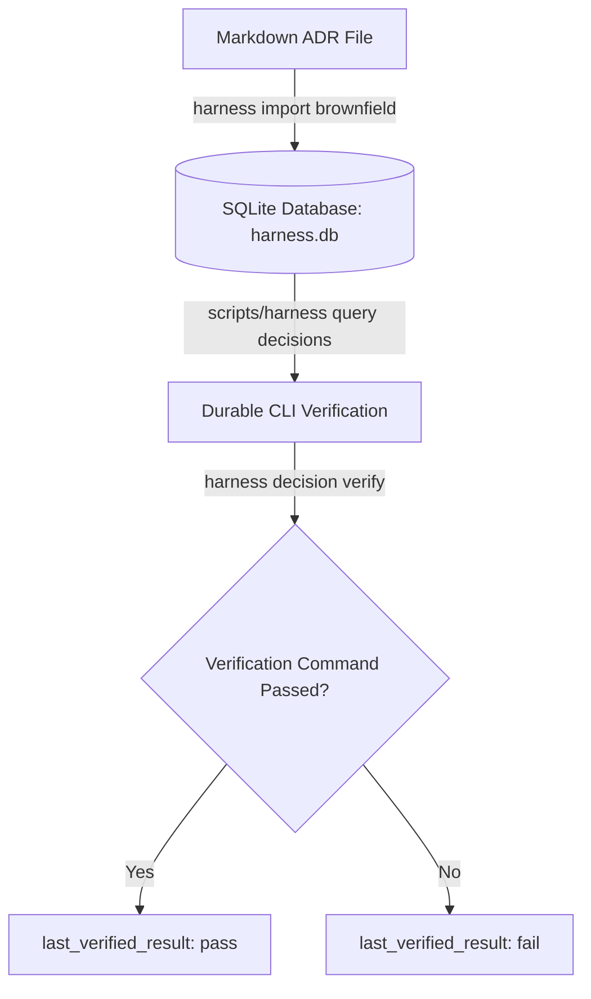

# Architecture Decision Records (ADR)

Welcome to the **Architecture Decision Records (ADR)** catalog. This directory contains the chronological record of all significant architectural, design, and structural decisions made in the `harness` project.

> [!NOTE]
> **The app is what users touch. The harness is what agents touch.**
> Architecture Decision Records ensure that both human engineers and AI coding agents operate with shared architectural context, inheriting past constraints and structural choices rather than repeatedly rediscovering or violating them.

---

## 🏛️ What are Architecture Decision Records?

An **Architecture Decision Record (ADR)** is a short text file capturing an architectural decision, its context, the alternatives considered, and its consequences (both positive benefits and negative tradeoffs). 

By capturing these choices in a stable, version-controlled markdown format, we achieve:
1. **Durable Architecture Context**: Future AI agents (Claude, Cursor, Antigravity, etc.) immediately inherit past design constraints upon entering the workspace.
2. **Context Bloat Prevention**: Rather than putting a massive technical specification in the prompt, the agent is directed to specific ADRs when relevant.
3. **Durable State Validation**: Many ADRs include programmatic verification commands that the CLI executes to verify compliance.

---

## 🔄 Integration with the Durable Layer

In the Harness framework, these markdown documents are **active blueprints**, not just passive prose. 



When you run `./scripts/harness import brownfield`, the Harness compiler parses these files and synchronizes them into the `decision` table inside `harness.db`. 

---

## ⚙️ When to Write an ADR

You **must** record a decision whenever:
* ⚠️ A locked technical choice or stack dependency changes.
* ⚠️ A core product rule or domain contract is modified.
* ⚠️ A validation requirement (e.g., unit test, integration test suite) is added, removed, or weakened.
* ⚠️ A high-risk story requires choosing one complex design pattern over another.
* ⚠️ The source-of-truth hierarchy of the repository is altered.

*To create a new record, copy [docs/templates/decision.md](../templates/decision.md) and number it sequentially (e.g. `0008-your-title.md`).*

---

## 🗂️ Current Decisions Catalog

Here is the current timeline of accepted architectural decisions in our repository:

| ID | Date | Decision Title | Status | Impact / Summary |
| :--- | :--- | :--- | :--- | :--- |
| **0001** | 2026-05-22 | [Harness-First Development](0001-harness-first-development.md) | `accepted` | Established the framework rule: focus on agent-ready constraints first. |
| **0002** | 2026-05-22 | [Seed Specification Product Lifecycle](0002-post-spec-product-lifecycle.md) | `superseded` | Outlined early product spec decompositon rules. |
| **0003** | 2026-05-22 | [Generic Spec Intake Harness](0003-generic-spec-intake-harness.md) | `accepted` | Defined the initial classification framework for incoming features. |
| **0004** | 2026-05-22 | [SQLite Durable Layer](0004-sqlite-durable-layer.md) | `accepted` | Introduced `harness.db` and the CLI to move away from fragile manually edited markdown tables. |
| **0005** | 2026-05-23 | [Prebuilt Rust Harness CLI](0005-prebuilt-rust-harness-cli.md) | `accepted` | Rewrote the shell-based CLI in Rust for compiled speed and unit testability. |
| **0006** | 2026-05-23 | [Flat Crate Repository Layout](0006-flat-crate-repository-layout.md) | `accepted` | Flat refactoring: removed nested workspace folders to reduce cognitive load and simplify local cargo testing. |
| **0007** | 2026-05-23 | [Harness Manifest and Package Renaming](0007-harness-manifest-and-package-renaming.md) | `superseded` | Branded the manifest and package from generic Cargo names to `harness.toml` / `harness.lock`. |
| **0008** | 2026-05-23 | [BMAD Method Agent Collaboration](0008-bmad-method-agent-collaboration.md) | `accepted` | Integrated the BMAD Method framework to introduce structured role-based agile gates. |
| **0009** | 2026-05-24 | [Reverting to Standard Cargo Manifests](0009-reverting-to-standard-cargo-manifests.md) | `accepted` | Reverted to standard `Cargo.toml`/`Cargo.lock` filenames to fix Cargo 1.95+ issues and restore IDE Analyzer functionality. |

---

## 🛠️ Handy Commands

To query, verify, and synchronize decision records in your active terminal:

```bash
# Synchronize new or modified markdown decisions to the database
./scripts/harness import brownfield

# List the current decisions and their verification status
./scripts/harness query decisions

# Run the automated compliance verification command defined inside a decision
./scripts/harness decision verify <decision_id>
```
